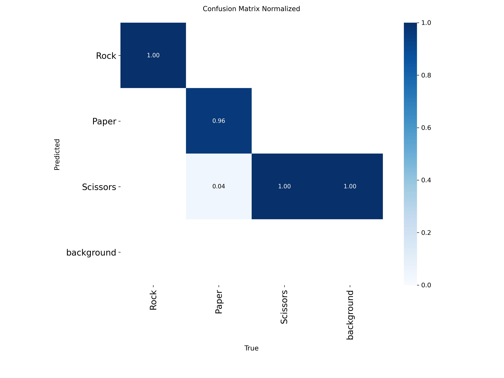
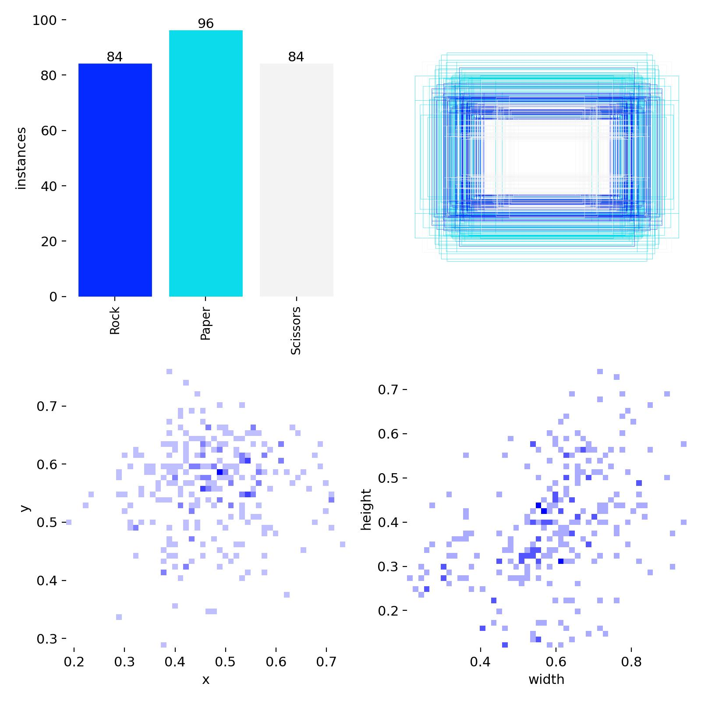

# Real-Time Hand Gesture Recognition & System Controller (YOLO)

## System Overview
This repository contains an end-to-end object detection pipeline trained to recognize hand gestures (Rock, Paper, Scissors) in real-time video feeds. Built utilizing the **YOLO (Ultralytics)** framework and **OpenCV**, this project goes beyond a standard classification task by deploying the trained weights into interactive, real-world applications: an AI-driven Rock-Paper-Scissors game and a hands-free macOS volume controller.

### 🔬 Engineering & Design Highlights
While achieving high validation metrics is standard, this pipeline was specifically engineered to operate robustly in messy, real-world webcam environments without requiring a green screen or controlled lighting.

* **Negative Background Sampling:** To prevent the model from hallucinating "hands" in complex backgrounds, the custom dataset intentionally included heavily varied, empty background frames (walls, furniture). By training on these "Negative Samples" (images with no bounding boxes), the model explicitly learned background constraints.
* **Spatial Augmentations to Break Center Bias:** To ensure the model learned the geometric shape of the hands rather than just their location, aggressive `mosaic` augmentation was applied. Combined with rotational adjustments (±15 degrees) and scaling, this ensured the model remained highly accurate regardless of wrist angle, camera distance, or hand placement.
* **Solving the "Skin-Color" False Positive:** Early iterations of the model correctly identified "Rock" but falsely flagged the user's face/head due to skin-tone similarities. Instead of over-constraining the model mathematically, a **Spatial Region of Interest (ROI) "Game Zone"** was engineered via OpenCV, logically filtering out bounding boxes outside the designated interactive area or exceeding specific dimension ratios.

## My Core Engineering Contributions
* **End-to-End Custom Data Curation:** Managed the entire machine learning lifecycle. Sourced, manually annotated, and balanced a custom image dataset (355 images). Developed automated Python scripts to flatten directories and split the data into a strict 80/20 train/validation YOLO-compliant structure.
* **Interactive OS-Level Deployment:** Bridged the gap between raw AI predictions and practical software by mapping class IDs to macOS system commands (e.g., executing `osascript` via Python to map "Paper" to Volume Up, and "Scissors" to Mute) with built-in action cooldowns to prevent erratic behavior.
* **Dynamic Thresholding:** Fine-tuned confidence thresholds (`conf=0.4` to `0.6`) dynamically based on class difficulty—specifically lowering the threshold to capture "Scissors" reliably during high motion-blur states while utilizing spatial bounds to reject noise.

## Tech Stack
* **Frameworks/Libraries:** PyTorch, Ultralytics (YOLO), OpenCV
* **Data Processing:** Python, OS module, Random, Shutil
* **Hardware Optimization:** Apple Silicon (MPS) accelerated training

## Model Evaluation & Performance
The model achieved an exceptional **99% mAP50**, proving that the diverse background sampling and mosaic augmentations successfully isolated the hand features. 
* **Rock:** 1.00 Accuracy
* **Scissors:** 1.00 Accuracy
* **Paper:** 0.96 Accuracy (Negligible variance)

## Confusion Matrix & Data Balance



## Performance Metrics


## How to Run

1. **Install Dependencies:**
   ```bash
   pip install ultralytics opencv-python torch torchvision
